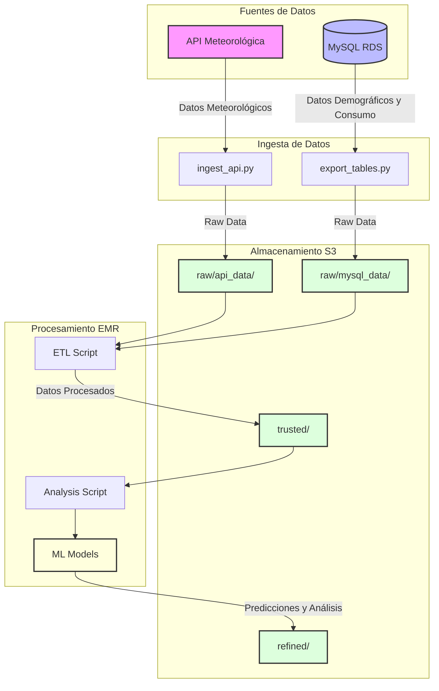

# ST0263 Tópicos Especiales en Telemática

# Estudiante(s):
- Alejandro Ríos Muñoz - ariosm@eafit.edu.co
- Lina Sofía Ballesteros Merchán - lsballestm@eafit.edu.co
- Jhonnatan Stiven Ocampo Díaz - jsocampod@eafit.edu.co

# Profesor:
- Edwin Nelson Montoya Munera, emontoya@eafit.edu.co

# Weather ETL Pipeline
## 1. Descripción de la actividad
Este proyecto implementa un pipeline de datos para recolectar, procesar y analizar datos meteorológicos de varias ciudades alrededor del mundo. El sistema integra datos de una API meteorológica con información demográfica y de consumo almacenada en MySQL, realizando transformaciones y análisis predictivo usando Spark.

### 1.1. Aspectos desarrollados
- ✅ Recolección automática de datos meteorológicosd de ciudades del mundo mediante API
- ✅ Integración con base de datos MySQL para datos demográficos y de consumo
- ✅ Pipeline ETL completo usando Apache Spark
- ✅ Implementación de modelos de Machine Learning (Regresión Lineal y Random Forest)
- ✅ Almacenamiento en capas (raw, trusted, refined) en S3
- ✅ Automatización del despliegue en EMR
- ✅ Análisis de correlaciones y predicciones de temperatura

### 1.2. Aspectos NO desarrollados
- Todo los objetivos fueron desarrollados.

# 2. Información de diseño

## Arquitectura



El proyecto sigue una arquitectura de procesamiento por lotes con tres capas principales:
1. **Capa de Ingesta**: Scripts Python para recolección de datos
2. **Capa de Procesamiento**: Jobs Spark para transformación y análisis
3. **Capa de Almacenamiento**: Amazon S3 con estructura de medallón (bronze/silver/gold)

## Patrones y Mejores Prácticas
- Arquitectura de medallón (Raw → Trusted → Refined)
- Código modular y reutilizable
- Control de versiones para datos y código
- Manejo de errores y logging
- Configuración externalizada

# 3. Ambiente de Desarrollo

## Tecnologías Utilizadas
- Python 3.8+
- Apache Spark 3.3.0
- PySpark 3.3.0
- Pandas 1.5.0
- Boto3 1.26.0
- MySQL Connector 8.0.31

## Configuración del Ambiente
1. Clonar el repositorio:
```bash
git clone https://github.com/usuario/weather-etl-pipeline.git
cd weather-etl-pipeline
```

2. Crear ambiente virtual:
```bash
python -m venv venv
source venv/bin/activate  # Linux/Mac
venv\Scripts\activate     # Windows
```

3. Instalar dependencias:
```bash
pip install -r requirements.txt
```

## Estructura del Proyecto
```
weather-etl-pipeline/
├── scripts/
│   ├── ingest_api.py       # Ingesta de datos meteorológicos
│   ├── export_tables.py    # Exportación de datos MySQL
│   ├── etl_script.py       # Procesamiento ETL en Spark
│   ├── analysis_script.py  # Análisis y ML
│   └── emr_creation.py     # Creación cluster EMR
├── sql/
│   └── create_tables.sql   # Esquema de base de datos
├── datasets/
│   └── raw_data/
│       └── mysql_data/     # Datos estáticos
└── README.md
```

# 4. Ambiente de Producción

## Infraestructura
- Amazon EMR 6.9.0
- Amazon S3
- Amazon RDS (MySQL)

## Configuración
1. Variables de ambiente necesarias:
```bash
export AWS_ACCESS_KEY_ID=your_access_key
export AWS_SECRET_ACCESS_KEY=your_secret_key
export MYSQL_HOST=your_rds_endpoint
export MYSQL_USER=admin
export MYSQL_PASSWORD=your_password
```

2. Estructura de buckets S3:
```
s3://weather-etl-data-st0263/
├── raw_data/
│   ├── api_data/
│   └── mysql_data/
├── trusted/
└── refined/
```

## Ejecución
1. Ingesta de datos:
```bash
python scripts/ingest_api.py
python scripts/export_tables.py
```

2. Procesamiento en EMR:
```bash
python scripts/emr_creation.py
```

## Resultados
Los datos procesados se almacenan en las siguientes ubicaciones:
- Datos crudos: `s3://weather-etl-data-st0263/raw_data/`
- Datos procesados: `s3://weather-etl-data-st0263/trusted/`
- Análisis y predicciones: `s3://weather-etl-data-st0263/refined/`

# 5. Información Adicional
- El proyecto incluye manejo de errores y reintentos para la ingesta de API
- Los modelos ML se reentrenan diariamente con nuevos datos
- Las predicciones tienen un RMSE promedio de X°C

# Referencias
- [Open-Meteo API Documentation](https://open-meteo.com/en/docs)
- [Apache Spark ML Guide](https://spark.apache.org/docs/latest/ml-guide.html)
- [AWS EMR Documentation](https://docs.aws.amazon.com/emr/latest/ReleaseGuide/emr-release-components.html)
- [Modern Data Engineering with Apache Spark](https://www.databricks.com/learn/training/modern-data-engineering-with-apache-spark)